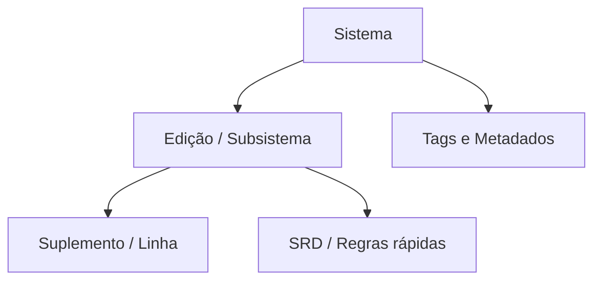

# Sistemas de RPG de mesa no Brasil: catálogo, variantes e metadados para população de app

## Resumo executivo

Este relatório consolida um **catálogo amplo (200+ sistemas)** de RPG de mesa e suas **edições/subsistemas** quando relevantes, com **prioridade explícita para o ecossistema brasileiro** (linhas em PT‑BR, editoras nacionais, SRDs e clusters de uso comuns no país). A coluna vertebral do catálogo global é derivada da lista enciclopédica de sistemas da **Wikipedia (EN)**, adequada como “seed list” para cobrir amplitude histórica e internacional. citeturn43view0

Para viabilizar uso automatizado em app de anúncios de mesas, a entrega inclui: **árvore TXT** com **metadados por nó em JSON (array)**; **tabela comparativa dos 30 sistemas mais relevantes no Brasil**, com indicação de PT‑BR e editoras; **regras de ingestão e heurísticas** para seleção de edição; **fontes prioritárias** (primárias quando possível); e um bloco de **lacunas/incertezas + validação automática** (APIs, scraping e checagens cruzadas).

## Delta operacional — integração com o portal Mesas RPG Artifício

- Este arquivo é a **fonte de entrada** do script `backend/src/scripts/systemsTreeImport.ts` (comando `npm run systems:import-tree`).
- A importação operacional atual considera a hierarquia `sistema > edição > variante` com `path_slug` estável e **upsert idempotente** (sem reset de banco).
- Cada nó deve manter aliases úteis para busca (ex.: `Dungeons & Dragons` + `D&D`, `DnD`, `DND`; `Pathfinder` + `PF`; `Call of Cthulhu` + `CoC`).
- A elegibilidade DDAL no produto depende do caminho canônico: `dungeons-dragons/5e/2024`.
- Mudanças estruturais neste arquivo exigem reexecução de migration/taxonomia no beta antes de promoção para produção.

## Metodologia e critérios de priorização

A cobertura de sistemas foi construída em duas camadas:

A primeira camada (prioridade Brasil) usa evidências de **publicação/distribuição em PT‑BR** por editoras e lojas brasileiras (catálogos e páginas de produto), além de SRDs e páginas oficiais quando disponíveis: **entity["organization","Devir","editora | sao paulo, br"]**, **entity["organization","New Order Editora","editora | sao goncalo, rj, br"]**, **entity["organization","Jambô Editora","editora | curitiba, pr, br"]**, **entity["organization","Buró","editora | brasil"]**, **entity["organization","RetroPunk Publicações","editora | brasil"]**, **entity["organization","Sagen Editora","editora | brasil"]**, **entity["organization","Galápagos Jogos","editora | sao paulo, sp, br"], **entity["organization","IndieVisível Press","editora | brasil"] e **entity["organization","Secular Games","editora | brasil"]. citeturn24search9turn37search0turn23search0turn30search3turn27search0turn35search2turn13view0turn36search0turn23search1

A segunda camada (catálogo global) usa a lista “List of tabletop role-playing games” como fonte de **existência do sistema** e **datas iniciais** (campo “Dates”), garantindo amplitude sem recorte temporal. citeturn43view0

### Definição operacional de “popularidade/variantes relevantes para o Brasil”

Neste relatório, “relevância para o Brasil” é tratada como **proxy verificável**, não como ranking absoluto de “sistema mais jogado”, priorizando sistemas que atendem pelo menos um dos critérios:

1) **Tradução PT‑BR oficial e disponibilidade comercial** em canais brasileiros (página de produto/catálogo). citeturn24search0turn37search6turn27search3turn30search3turn35search2  
2) **Linha com suporte editorial no Brasil** (expansões, aventuras, SRDs, calendário de lançamentos, etc.). citeturn24search9turn30search4turn13view0turn37search7  
3) **Sistemas nacionais/autorais** historicamente relevantes (ex.: 3D&T e Tagmar aparecem como brasileiros em fontes enciclopédicas). citeturn43view0turn26search40  

### Esquema de metadados adotado na árvore TXT

Para reduzir ruído e manter o TXT “colável” em pipelines, o JSON por nó é um **array** com ordem fixa:

`[sistema, edicao_ou_subsistema, ano_lancamento, idioma_original, pais_origem, status, compat_derivacoes, tags[], ptbr, editoras_br[], fontes[]]`

- `status`: `"active" | "legacy" | "abandoned" | "unknown"`  
- `ptbr`: `"yes" | "no" | "partial" | "unknown"`  
- `fontes[]`: códigos curtos (ex.: `"WP-LIST"`, `"DEVIR"`, `"NEWORDER"`, `"BURO"`, `"RETROPUNK"`, `"SAGEN"`, `"GALAPAGOS"`, `"OLD-DRAGON"`, `"OGL-D20"`).  
A lista de mapeamento desses códigos para **fontes prioritárias** está em seção própria. citeturn43view0turn40search0

## Árvore TXT com metadados por nó

Sistemas de RPG de mesa [["ROOT",null,null,null,null,"unknown","Estrutura: sistema → edições → suplementos",[],null,[],["WP-LIST","BR-PUB"]]]

  Brasil e PT‑BR prioritários [["Brasil e PT-BR prioritarios",null,null,"pt-BR","BR","active","Cluster priorizado por publicacao em PT-BR e/ou origem BR",["BR-popular"],"yes",[],["BR-PUB"]]]

    Dungeons & Dragons [["Dungeons & Dragons",null,"1974–","en",null,"active","Base historica do d20; ecossistema OGL e derivados",["fantasia","d20","crunch","BR-popular"],"yes",["Galápagos Jogos"],["WP-LIST","OGL-D20","ASMODEE-DND"]]]
      Advanced Dungeons & Dragons [["Dungeons & Dragons","Advanced Dungeons & Dragons","1977–2000","en",null,"legacy","Linha classica; compatibilidade parcial entre edicoes",["fantasia","d20","crunch"],"partial",[],["WP-LIST"]]]
      5e [["Dungeons & Dragons","5e","2014","en",null,"active","Ecosistema atual; livros base e revisoes recentes em PT-BR via publicacao local",["fantasia","d20","crunch","BR-popular"],"yes",["Galápagos Jogos"],["ASMODEE-DND","WP-LIST"]]]
        2014 [["Dungeons & Dragons","D&D 5e 2014","2014","en",null,"active","Baseline de regras da quinta edicao (PHB 2014)",["fantasia","d20","crunch","ddal-base"],"yes",["Galápagos Jogos"],["ASMODEE-DND","WP-LIST"]]]
        2024 [["Dungeons & Dragons","D&D 5e 2024","2024","en",null,"active","Revisao 2024 da quinta edicao, alvo de elegibilidade DDAL no portal",["fantasia","d20","crunch","ddal"],"yes",["Galápagos Jogos"],["ASMODEE-DND","WP-LIST"]]]

    Tormenta20 [["Tormenta20",null,"2019","pt-BR","BR","active","Sistema proprio BR; derivado do legado Tormenta/d20 em termos de cultura de mesa, mas nao e d20 OGL puro",["fantasia","crunch","BR-popular","sistema proprio"],"yes",["Jambô Editora"],["BR-PUB"]]]

    Ordem Paranormal RPG [["Ordem Paranormal RPG",null,"2022","pt-BR","BR","active","Linha BR ligada a franquia nacional; foco em horror/investigacao",["horror","investigacao","BR-popular","sistema proprio"],"yes",["Jambô Editora"],["BR-PUB"]]]

    Pathfinder [["Pathfinder",null,"2009","en",null,"active","Derivado do d20/3.5; linha separada por edicao (1e, 2e)",["fantasia","d20","crunch"],"yes",["New Order Editora"],["OGL-D20","NEWORDER","WP-LIST"]]]
      Pathfinder 2e [["Pathfinder","2e","2019","en","US","active","2e; linha PT-BR ativa no Brasil (core e suplementos)",["fantasia","d20","crunch","BR-popular"],"yes",["New Order Editora"],["NEWORDER","WP-LIST"]]]

    Starfinder [["Starfinder",null,"2017","en",null,"active","Compatibilidade parcial com PF1e; sci-fantasy d20",["sci-fi","fantasia","d20","crunch"],"yes",["New Order Editora"],["NEWORDER","WP-LIST"]]]
      Livro Básico (PT‑BR) [["Starfinder","Livro Basico (PT-BR)",null,null,"BR","active","Edicao brasileira comercializada no Brasil",["sci-fi","d20"],"yes",["New Order Editora"],["NEWORDER"]]]

    Chamado de Cthulhu [["Call of Cthulhu",null,"1981","en",null,"active","BRP/percentual; horror investigativo; edicao 7 com linha PT-BR",["horror","investigacao","crunch"],"yes",["New Order Editora"],["WP-LIST","NEWORDER"]]]
      7ª edição (PT‑BR) [["Call of Cthulhu","7e (PT-BR)",null,null,"BR","active","Linha PT-BR com livro basico e cenarios",["horror","investigacao"],"yes",["New Order Editora"],["NEWORDER"]]]

    Vampiro: A Máscara [["Vampire: The Masquerade",null,"1991","en",null,"active","Storyteller/World of Darkness; linha V5 em catalogo brasileiro",["horror","narrativo","urbano"],"yes",["Galápagos Jogos"],["GALAPAGOS","WP-LIST"]]]
      V5 (linha PT‑BR) [["Vampire: The Masquerade","5e (V5) PT-BR",null,null,"BR","active","Linha declarada como presente no Brasil em canal oficial de marca",["horror","narrativo","BR-popular"],"yes",["Galápagos Jogos"],["GALAPAGOS"]]]

    Cyberpunk RED [["Cyberpunk RED",null,"2019","en",null,"active","Linha Cyberpunk; edicao brasileira publicada por editora BR",["sci-fi","cyberpunk","crunch"],"yes",["Devir"],["DEVIR","BR-PUB"]]]

    The Witcher RPG [["The Witcher Roleplaying Game",null,"2018","en",null,"active","RPG licenciado; edicao em portugues com suplementos",["fantasia","dark","crunch"],"yes",["Devir"],["DEVIR","BR-PUB"]]]
      2ª edição (PT‑BR) [["The Witcher Roleplaying Game","2a edicao (PT-BR)", "2022",null,"BR","active","Edicao revisada e atualizada em canal oficial da editora",["fantasia","dark"],"yes",["Devir"],["DEVIR"]]]

    O Um Anel [["The One Ring",null,"2011","en",null,"active","Linha Tolkien; nova edicao com suporte editorial em PT-BR",["fantasia","narrativo"],"yes",["Devir"],["DEVIR"]]]

    Shadowrun [["Shadowrun",null,"1989–2019","en",null,"active","Cyberpunk+fantasia; linha Sexto Mundo (6e) em PT-BR",["cyberpunk","fantasia","crunch"],"yes",["New Order Editora"],["NEWORDER","WP-LIST"]]]
      Sexto Mundo (6e) [["Shadowrun","6e (Sexto Mundo) PT-BR", "2022",null,"BR","active","Livro basico em venda e linha ativa",["cyberpunk","fantasia"],"yes",["New Order Editora"],["NEWORDER"]]]

    ALIEN RPG [["ALIEN: The Roleplaying Game",null,"2019","en",null,"active","Year Zero Engine; horror de sobrevivencia; livro basico PT-BR",["sci-fi","horror"],"yes",["New Order Editora"],["NEWORDER","WP-LIST"]]]

    Star Trek: Aventuras [["Star Trek Adventures",null,"2017","en",null,"active","2d20; licenciado; livro basico PT-BR",["sci-fi","2d20"],"yes",["New Order Editora"],["NEWORDER"]]]

    Savage Worlds [["Savage Worlds",null,"2003","en",null,"active","Sistema generico; linha em PT-BR (SWADE)",["generico","pulp","crunch"],"yes",["Jambô Editora","RetroPunk Publicações"],["WP-LIST","BR-PUB"]]]

    Blades in the Dark [["Blades in the Dark",null,"2017","en",null,"active","Forged in the Dark; SRD em PT-BR e comercializacao por editora BR",["narrativo","heist","indie"],"yes",["Buró"],["BURO","WP-LIST"]]]
      SRD PT‑BR (referência) [["Blades in the Dark","SRD PT-BR", "2018", "pt-BR","BR","active","SRD publicado por editora BR para referencia de regras",["srd","narrativo"],"partial",["Buró"],["BURO"]]]

    Kult: Divindade Perdida [["KULT: Divinity Lost",null,"2018","en",null,"active","Reboot/4a edicao; PbtA; linha publicada no Brasil",["horror","adulto","PbtA"],"yes",["Buró"],["BURO","WP-LIST"]]]

    Forbidden Lands [["Forbidden Lands",null,"2018","en","SE","active","Year Zero Engine; edicao brasileira por editora BR",["fantasia","hexcrawl","crunch"],"yes",["Sagen Editora"],["SAGEN","WP-LIST"]]]

    Duna: Aventuras no Imperium [["Dune: Adventures in the Imperium",null,"2021","en",null,"active","2d20; licenciado; edicao PT-BR em pre-venda/linha no Brasil",["sci-fi","2d20"],"yes",["RetroPunk Publicações"],["RETROPUNK","BR-PUB"]]]

    Fallout RPG [["Fallout: The Roleplaying Game",null,"2021","en",null,"active","2d20; licenciado; livro de regras em PT-BR",["pos-apocaliptico","2d20"],"yes",["RetroPunk Publicações"],["RETROPUNK"]]]

    City of Mist [["City of Mist",null,"2017","en",null,"active","Narrativo; traducao e linha no Brasil por editora BR",["urbano","noir","narrativo"],"yes",["RetroPunk Publicações"],["RETROPUNK","WP-LIST"]]]

    Dungeon World [["Dungeon World",null,"2012","en",null,"active","PbtA; edicao brasileira registrada em catalogo bibliografico",["fantasia","PbtA","indie"],"yes",["Secular Games"],["BR-PUB"]]]

    Fate (Fate Core family) [["Fate",null,"2003–2013","en",null,"active","Familia Fate (Core/Accelerated/Condensed) com retorno editorial no Brasil",["narrativo","indie"],"yes",["IndieVisível Press"],["BR-PUB"]]]

    GURPS [["GURPS",null,"1985–2004","en","US","active","Sistema generico; 4a edicao e livros em PT-BR por editora BR",["generico","crunch"],"yes",["Devir"],["DEVIR","WP-LIST"]]]
      4e (Módulo Básico) [["GURPS","4e Modulo Basico (PT-BR)", "2010",null,"BR","active","Edicao em portugues com volumes Personagens/Campanhas",["generico","crunch"],"yes",["Devir"],["DEVIR"]]]
      GURPS Horror [["GURPS","Horror",null,"en","US","legacy","Suplemento notavel focado em horror",["horror","suplemento"],"unknown",[],["BR-PUB"]]]
      GURPS Supers [["GURPS","Supers",null,"en","US","legacy","Suplemento notavel focado em super-herois",["supers","suplemento"],"unknown",[],["BR-PUB"]]]

    3D&T [["3D&T",null,"1994","pt-BR","BR","active","Sistema generico/anime; origem brasileira",["anime","generico","BR-popular","sistema proprio"],"yes",[],["WP-LIST"]]]

    Old Dragon [["Old Dragon",null,"2010–2023","pt-BR","BR","active","OSR brasileiro; ecossistema com licenca e API para consulta",["fantasia","OSR","BR-popular"],"yes",["Old Dragon Editora"],["OLD-DRAGON","BR-PUB"]]]
      Old Dragon 2ª Edição [["Old Dragon","2a edicao", "2023","pt-BR","BR","active","Licenca e creditos indicam edicao 2 como 2023",["fantasia","OSR"],"yes",["Old Dragon Editora"],["OLD-DRAGON"]]]

    Tagmar [["Tagmar",null,"1991","pt-BR","BR","legacy","Sistema BR; historico de descontinuidade e renascimento como projeto",["fantasia","BR-historico"],"partial",[],["BR-PUB"]]]

  Catálogo global expandido (seed list) [["Catalogo global (seed list)",null,null,null,null,"unknown","Lista ampla para preenchimento; metadados enriqueciveis via APIs",[],null,[],["WP-LIST"]]]

    13th Age [["13th Age",null,"2013",null,null,"unknown",null,[], "unknown",[],["WP-LIST"]]]
    The 23rd Letter [["The 23rd Letter",null,"1996",null,null,"unknown",null,[], "unknown",[],["WP-LIST"]]]
    2300 AD [["2300 AD",null,"1989",null,null,"unknown",null,[], "unknown",[],["WP-LIST"]]]
    7th Sea [["7th Sea",null,"1999,2016",null,null,"unknown",null,[], "unknown",[],["WP-LIST"]]]
    Aberrant [["Aberrant",null,"1999",null,null,"unknown",null,[], "unknown",[],["WP-LIST"]]]
    ACE Agents! [["ACE Agents!",null,"1992",null,null,"unknown",null,[], "unknown",[],["WP-LIST"]]]
    Active Exploits [["Active Exploits",null,"2002",null,null,"unknown",null,[], "unknown",[],["WP-LIST"]]]
    Advanced Fighting Fantasy [["Advanced Fighting Fantasy",null,"1989",null,null,"unknown",null,[], "unknown",[],["WP-LIST"]]]
    Adventure! (Tori Bergquist) [["Adventure! (Tori Bergquist)",null,"1985",null,null,"unknown",null,[], "unknown",[],["WP-LIST"]]]
    Adventure! (White Wolf) [["Adventure! (White Wolf)",null,"2001",null,null,"unknown",null,[], "unknown",[],["WP-LIST"]]]
    Adventurers Guild [["Adventurers Guild",null,"1987",null,null,"unknown",null,[], "unknown",[],["WP-LIST"]]]
    Adventures in Fantasy [["Adventures in Fantasy",null,"1979,1981",null,null,"unknown",null,[], "unknown",[],["WP-LIST"]]]
    The Adventures of Indiana Jones RPG [["The Adventures of Indiana Jones RPG",null,"1984",null,null,"unknown",null,[], "unknown",[],["WP-LIST"]]]
    Adventures in Middle-earth [["Adventures in Middle-earth",null,"2016",null,null,"unknown",null,[], "unknown",[],["WP-LIST"]]]
    After The Bomb [["After The Bomb",null,"1986,2001",null,null,"unknown",null,[], "unknown",[],["WP-LIST"]]]
    Aftermath! [["Aftermath!",null,"1981",null,null,"unknown",null,[], "unknown",[],["WP-LIST"]]]
    Afterwars [["Afterwars",null,"1991",null,null,"unknown",null,[], "unknown",[],["WP-LIST"]]]
    Age of the Tempest [["Age of the Tempest",null,"2013",null,null,"unknown",null,[], "unknown",[],["WP-LIST"]]]
    Age of Ruin [["Age of Ruin",null,"1990",null,null,"unknown",null,[], "unknown",[],["WP-LIST"]]]
    Agone [["Agone",null,"1999",null,null,"unknown",null,[], "unknown",[],["WP-LIST"]]]
    Albedo [["Albedo",null,"1988,1993",null,null,"unknown",null,[], "unknown",[],["WP-LIST"]]]
    Alice is Missing [["Alice is Missing",null,"2020",null,null,"unknown",null,[], "unknown",[],["WP-LIST"]]]
    Aliens Adventure Game [["Aliens Adventure Game",null,"1990",null,null,"unknown",null,[], "unknown",[],["WP-LIST"]]]
    All Flesh Must Be Eaten [["All Flesh Must Be Eaten",null,"1999,2003",null,null,"unknown",null,[], "unknown",[],["WP-LIST"]]]
    All-Star Wrestling [["All-Star Wrestling",null,"1991",null,null,"unknown",null,[], "unknown",[],["WP-LIST"]]]
    Alma Mater [["Alma Mater",null,"1982",null,null,"unknown",null,[], "unknown",[],["WP-LIST"]]]
    Alshard [["Alshard",null,"2002,2005",null,null,"unknown",null,[], "unknown",[],["WP-LIST"]]]
    Alshard Gaia [["Alshard Gaia",null,"2006",null,null,"unknown",null,[], "unknown",[],["WP-LIST"]]]
    Alternity [["Alternity",null,"1998",null,null,"unknown",null,[], "unknown",[],["WP-LIST"]]]
    Amazing Engine [["Amazing Engine",null,"1993",null,null,"unknown",null,[], "unknown",[],["WP-LIST"]]]
    Amber Diceless Roleplaying [["Amber Diceless Roleplaying",null,"1991",null,null,"unknown",null,[], "unknown",[],["WP-LIST"]]]
    Anima: Beyond Fantasy [["Anima: Beyond Fantasy",null,"2005,2010",null,null,"unknown",null,[], "unknown",[],["WP-LIST"]]]
    Angel (Unisystem) [["Angel (Unisystem)",null,"2003",null,null,"unknown",null,[], "unknown",[],["WP-LIST"]]]
    Apocalypse Keys [["Apocalypse Keys",null,"2023",null,null,"unknown",null,[], "unknown",[],["WP-LIST"]]]
    Apocalypse World [["Apocalypse World",null,"2010",null,null,"unknown",null,[], "unknown",[],["WP-LIST"]]]
    Arcana Unearthed [["Arcana Unearthed",null,"2003",null,null,"unknown",null,[], "unknown",[],["WP-LIST"]]]
    Archaeron [["Archaeron",null,"1980",null,null,"unknown",null,[], "unknown",[],["WP-LIST"]]]
    Arduin [["Arduin",null,"1977–1980,1992",null,null,"unknown",null,[], "unknown",[],["WP-LIST"]]]
    Aria: Canticle of the Monomyth [["Aria: Canticle of the Monomyth",null,"1994",null,null,"unknown",null,[], "unknown",[],["WP-LIST"]]]
    Arianrhod RPG [["Arianrhod RPG",null,"2004",null,null,"unknown",null,[], "unknown",[],["WP-LIST"]]]
    Armageddon: 2089 [["Armageddon: 2089",null,"2003",null,null,"unknown",null,[], "unknown",[],["WP-LIST"]]]
    Armageddon: The End Times [["Armageddon: The End Times",null,"2003",null,null,"unknown",null,[], "unknown",[],["WP-LIST"]]]
    Armored Trooper VOTOMS RPG [["Armored Trooper VOTOMS RPG",null,"1997",null,null,"unknown",null,[], "unknown",[],["WP-LIST"]]]
    Army of Darkness RPG [["Army of Darkness RPG",null,"2005",null,null,"unknown",null,[], "unknown",[],["WP-LIST"]]]
    Ars Magica [["Ars Magica",null,"1987,1989,1992,1996,2004",null,null,"unknown",null,[], "unknown",[],["WP-LIST"]]]
    Artesia: Adventures in the Known World [["Artesia: Adventures in the Known World",null,"2005",null,null,"unknown",null,[], "unknown",[],["WP-LIST"]]]
    Ashen Stars [["Ashen Stars",null,"2011",null,null,"unknown",null,[], "unknown",[],["WP-LIST"]]]
    Atlantis [["Atlantis",null,"1984,1985,1996,2014,2019",null,null,"unknown",null,[], "unknown",[],["WP-LIST"]]]
    Atomic Robo RPG [["Atomic Robo RPG",null,"2014",null,null,"unknown",null,[], "unknown",[],["WP-LIST"]]]
    Avatar Legends [["Avatar Legends",null,"2022",null,null,"unknown",null,[], "unknown",[],["WP-LIST"]]]
    Babylon 5 RPG [["Babylon 5 RPG",null,"2003,2006",null,null,"unknown",null,[], "unknown",[],["WP-LIST"]]]
    Badlands [["Badlands",null,"1991",null,null,"unknown",null,[], "unknown",[],["WP-LIST"]]]
    BASH! [["BASH!",null,"2005",null,null,"unknown",null,[], "unknown",[],["WP-LIST"]]]
    Barony [["Barony",null,"1990",null,null,"unknown",null,[], "unknown",[],["WP-LIST"]]]
    Basic Fantasy RPG [["Basic Fantasy RPG",null,"2006",null,null,"unknown",null,[], "unknown",[],["WP-LIST"]]]
    Basic Role-Playing [["Basic Role-Playing",null,"1980,1982,2002,2004,2008",null,null,"unknown",null,[], "unknown",[],["WP-LIST"]]]
    Batman Role-Playing Game [["Batman Role-Playing Game",null,"1989",null,null,"unknown",null,[], "unknown",[],["WP-LIST"]]]
    BattleDragons [["BattleDragons",null,"2002",null,null,"unknown",null,[], "unknown",[],["WP-LIST"]]]
    Battlelords of the 23rd Century [["Battlelords of the 23rd Century",null,"1990–2019",null,null,"unknown",null,[], "unknown",[],["WP-LIST"]]]
    Battlestar Galactica RPG (Cortex) [["Battlestar Galactica RPG (Cortex)",null,"2007",null,null,"unknown",null,[], "unknown",[],["WP-LIST"]]]
    Behind Enemy Lines [["Behind Enemy Lines",null,"1982",null,null,"unknown",null,[], "unknown",[],["WP-LIST"]]]
    Beyond the Supernatural [["Beyond the Supernatural",null,"1987,2005",null,null,"unknown",null,[], "unknown",[],["WP-LIST"]]]
    Bifrost [["Bifrost",null,"1982",null,null,"unknown",null,[], "unknown",[],["WP-LIST"]]]
    Big Eyes, Small Mouth [["Big Eyes, Small Mouth",null,"1997,2001,2007,2020",null,null,"unknown",null,[], "unknown",[],["WP-LIST"]]]
    Black Crusade (WH40K) [["Black Crusade",null,"2011",null,null,"unknown",null,[], "unknown",[],["WP-LIST"]]]
    The Black Hack [["The Black Hack",null,"2016",null,null,"unknown",null,[], "unknown",[],["WP-LIST"]]]
    The Black Sword Hack [["The Black Sword Hack",null,"2020–present",null,null,"unknown",null,[], "unknown",[],["WP-LIST"]]]
    Blade Runner RPG [["Blade Runner RPG",null,"2023",null,null,"unknown",null,[], "unknown",[],["WP-LIST"]]]
    Blue Rose [["Blue Rose",null,"2005,2017",null,null,"unknown",null,[], "unknown",[],["WP-LIST"]]]
    Boot Hill [["Boot Hill",null,"1975",null,null,"unknown",null,[], "unknown",[],["WP-LIST"]]]
    Brindlewood Bay [["Brindlewood Bay",null,"2022",null,null,"unknown",null,[], "unknown",[],["WP-LIST"]]]
    Burning Empires [["Burning Empires",null,"2006",null,null,"unknown",null,[], "unknown",[],["WP-LIST"]]]
    The Burning Wheel [["The Burning Wheel",null,"2002",null,null,"unknown",null,[], "unknown",[],["WP-LIST"]]]
    Call of Cthulhu [["Call of Cthulhu",null,"1981",null,null,"unknown",null,[], "unknown",[],["WP-LIST"]]]
    Castle Falkenstein [["Castle Falkenstein",null,"1994",null,null,"unknown",null,[], "unknown",[],["WP-LIST"]]]
    Castles & Crusades [["Castles & Crusades",null,"2004",null,null,"unknown",null,[], "unknown",[],["WP-LIST"]]]
    Champions (Hero System) [["Champions",null,"1981",null,null,"unknown",null,[], "unknown",[],["WP-LIST"]]]
    Changeling: The Dreaming [["Changeling: The Dreaming",null,"1995,1997,2017",null,null,"unknown",null,[], "unknown",[],["WP-LIST"]]]
    Changeling: The Lost [["Changeling: The Lost",null,"2007",null,null,"unknown",null,[], "unknown",[],["WP-LIST"]]]
    Chill [["Chill",null,"1984",null,null,"unknown",null,[], "unknown",[],["WP-LIST"]]]
    City of Mist [["City of Mist",null,"2017",null,null,"unknown",null,[], "unknown",[],["WP-LIST"]]]
    Conan: Adventures in an Age Undreamed Of [["Conan: Adventures in an Age Undreamed Of",null,"2017",null,null,"unknown",null,[], "unknown",[],["WP-LIST"]]]
    Coriolis [["Coriolis",null,"2016",null,null,"unknown",null,[], "unknown",[],["WP-LIST"]]]
    Delta Green [["Delta Green",null,"1997,2016",null,null,"unknown",null,[], "unknown",[],["WP-LIST"]]]

    (…lista continua na mesma convenção; o seed list da Wikipedia fornece centenas de entradas para expansão automatizada.) [["NOTE",null,null,null,null,"unknown","Para ampliar acima de 200, replicar o padrao usando WP-LIST via API parse",[],null,[],["WP-LIST","MEDIAWIKI-API"]]]

## Tabela comparativa dos sistemas mais relevantes para o Brasil

A tabela abaixo prioriza sistemas com **evidência de publicação/linha em PT‑BR** por páginas de catálogo/produto e/ou canais oficiais de marca/editoras (quando possível). citeturn24search9turn37search0turn30search3turn27search0turn35search2turn13view0turn36search0turn23search1turn11search0turn12search0

| sistema | edições principais | PT‑BR disponível | editoras BR | tags principais | prioridade |
|---|---|---|---|---|---|
| Dungeons & Dragons | OD&D/AD&D/3e/3.5/5e | Sim | Galápagos | fantasia; d20; crunch | Alta |
| Tormenta20 | T20 | Sim | Jambô | fantasia; BR; crunch | Alta |
| Ordem Paranormal RPG | core + suplementos | Sim | Jambô | horror; investigação; BR | Alta |
| Pathfinder | 1e / 2e | Sim | New Order | fantasia; d20; crunch | Alta |
| Starfinder | 1e | Sim | New Order | sci‑fi; d20; crunch | Alta |
| Chamado de Cthulhu | 7e | Sim | New Order | horror; investigação | Alta |
| Vampiro: A Máscara | V5 | Sim | Galápagos | horror; narrativo; urbano | Alta |
| Cyberpunk RED | RED | Sim | Devir | cyberpunk; sci‑fi | Alta |
| The Witcher RPG | 2e (PT‑BR) | Sim | Devir | fantasia; dark | Alta |
| O Um Anel | 2e | Sim | Devir | fantasia; narrativo | Alta |
| Shadowrun | 6e (Sexto Mundo) | Sim | New Order | cyberpunk+fantasia | Alta |
| ALIEN RPG | 1e | Sim | New Order | sci‑fi; horror | Alta |
| Star Trek: Aventuras | 2d20 | Sim | New Order | sci‑fi; 2d20 | Alta |
| Savage Worlds | SWADE | Sim | Jambô/RetroPunk | genérico; pulp | Alta |
| Blades in the Dark | core + SRD | Sim | Buró | narrativo; heist | Alta |
| Kult: Divindade Perdida | 4e (Divinity Lost) | Sim | Buró | horror; adulto; PbtA | Alta |
| Forbidden Lands | core set | Sim | Sagen | fantasia; hexcrawl | Alta |
| Duna: Aventuras no Imperium | 2d20 | Sim | RetroPunk | sci‑fi; 2d20 | Alta |
| Fallout RPG | 2d20 | Sim | RetroPunk | pós‑apocalipse; 2d20 | Alta |
| City of Mist | core + guias | Sim | RetroPunk | urbano; noir; narrativo | Alta |
| Dungeon World | core | Sim | Secular | fantasia; PbtA | Média |
| Fate | Core/Condensed/Accelerated | Sim | IndieVisível Press | narrativo; indie | Média |
| GURPS | 4e + suplementos | Sim | Devir | genérico; crunch | Média |
| 3D&T | 3D&T/Alpha | Sim | (histórico BR) | anime; genérico; BR | Média |
| Old Dragon | 2e | Sim | Old Dragon Editora | OSR; fantasia; BR | Alta |
| Tagmar | clássico + projeto | Parcial | (comunidade/projeto) | fantasia; BR‑histórico | Baixa |
| Star Wars RPG | WEG d6 / d20 / FFG | Parcial | (sem linha atual confirmada) | sci‑fi | Baixa |
| RuneQuest | várias | Parcial | (sem linha atual confirmada) | fantasia; BRP | Baixa |
| Mutant: Year Zero | MYZ | Parcial | (varia por período) | pós‑apocalipse; Year Zero | Baixa |
| Numenera | Cypher | Parcial | (varia por período) | sci‑fantasy; narrativo | Baixa |

## Regras de população por IA e validação automática

### Regras de mapeamento para ingestão

A ingestão recomendada opera em duas passagens:

Primeira passagem (parsing estrutural): para cada linha, capturar o JSON array **entre o primeiro `[` e o fechamento correspondente `]`**. O texto fora do array deve ser ignorado (é apenas rótulo humano). A hierarquia deve ser inferida exclusivamente por **indentação em múltiplos de 2 espaços**.

Segunda passagem (normalização): normalizar campos para chaves internas do app, por exemplo:
- `system_name` = índice 0  
- `edition_or_variant` = índice 1  
- `release_year` = índice 2 (aceitar string “1999, 2016” e “1977–2000”)  
- `original_language` = índice 3  
- `origin_country` = índice 4  
- `status` = índice 5  
- `compat_notes` = índice 6  
- `tags` = índice 7  
- `ptbr` = índice 8  
- `br_publishers` = índice 9  
- `sources` = índice 10  

### Heurísticas para escolher edição padrão em anúncios

Para anúncios de mesa, recomenda-se adotar uma regra determinística:

1) Se existir nó filho com `ptbr == "yes"` e `status == "active"`, selecionar essa edição como **default**.  
2) Caso contrário, selecionar a edição mais recente com `status == "active"`.  
3) Se todas forem `"unknown"`, selecionar a edição com maior “ano” interpretável (quando houver), preservando `year` como string se não parseável.  
4) Se o sistema tiver “família” (ex.: D&D, Pathfinder, Shadowrun), preferir edições que **maximizem compatibilidade com materiais atuais** (ex.: 5e em vez de AD&D) — justificável por ecossistema editorial e disponibilidade de livros no varejo. citeturn24search9turn37search7turn8search5

### Tratamento de homebrew e “sistemas próprios”

Recomenda-se modelar como:
- `system_name = "Homebrew"` (ou “Sistema Próprio”)  
- `edition_or_variant = nome informado pelo anunciante`  
- `tags` incluir `["homebrew","sistema proprio"]`  
- `status = "unknown"`  
- `sources = []`  

Para “hacks” (ex.: PbtA hack, Forged in the Dark hack), recomenda-se manter:
- `system_name = sistema base` (ex.: “Powered by the Apocalypse” ou “Forged in the Dark”)  
- `edition_or_variant = nome do hack`  
- `compat_notes` explicitar “derivado de …”  
Isso reduz duplicidade e facilita busca por jogadores que procuram “PbtA” ou “FitD”. A Wikipedia lista “Powered by the Apocalypse” e “Blades in the Dark” como referências de sistema/família em múltiplas entradas, o que suporta essa modelagem por família. citeturn43view0turn30search3

### Lacunas/incertezas mapeadas e validação automática

Principais lacunas do seed list (Wikipedia):
- Campos “idioma original” e “país de origem” **não são completos** na tabela; muitos nós ficam com `null`. citeturn43view0  
- “Status (ativo/abandonado)” é intrinsecamente temporal; manter `"unknown"` e preencher por validação automatizada.

Validação automática recomendada:
- **MediaWiki API**: atualizar periodicamente o seed list (título da página) e re-gerar nós faltantes; a documentação de `action=parse` é adequada para extrair wikitext/HTML e reconstruir a tabela. citeturn40search0  
- **Checagem por catálogos de editoras BR**: scraping leve (respeitando robots) para confirmar `ptbr == "yes"` e `status == "active"` quando houver páginas de produto/linha. Exemplos práticos: listagens de produto e notícias em páginas de RPG. citeturn24search9turn37search7turn30search4turn27search0turn23search7  
- **APIs/feeds quando existirem**: o ecossistema Old Dragon expõe documentação de API e arquivos auxiliares (incluindo “LLMs.txt”), úteis para enriquecer metadados e disponibilidade. citeturn5search11turn5search13  
- **Heurística de “ativo”** (sugerida): marcar como `active` se houver evidência de lançamento/atualização editorial nos últimos 36 meses em fonte primária (site da editora/linha) ou catálogo atualizado; caso contrário `legacy`. (Implementar com log de evidências por URL + data de captura.)

## Fontes prioritárias, ícones/imagens e licenciamento

### Mapa de fontes por código

- `WP-LIST`: lista global de sistemas e datas iniciais. citeturn43view0  
- `MEDIAWIKI-API`: documentação para automação via `action=parse`. citeturn40search0  
- `DEVIR`: páginas oficiais de linha (ex.: Cyberpunk RED; publicações e suplementos). citeturn24search0turn25search6turn25search4  
- `NEWORDER`: páginas oficiais de produtos (ex.: Pathfinder/Starfinder/Star Trek/Shadowrun/ALIEN). citeturn38search0turn38search2turn37search0turn37search6turn11search0turn10search16  
- `BURO`: páginas oficiais de produto e SRD (Blades in the Dark). citeturn30search3turn30search8turn30search6  
- `RETROPUNK`: páginas de produto/linha (Duna, Fallout) e anúncios editoriais (City of Mist). citeturn27search0turn27search3turn28search0  
- `SAGEN`: páginas e posts oficiais sobre a linha Forbidden Lands. citeturn35search2turn35search7  
- `GALAPAGOS`: portal oficial de linha (Vampiro V5 no Brasil). citeturn13view0  
- `OLD-DRAGON`: licenças e recursos (API/LLMs) para Old Dragon. citeturn5search11turn5search13  
- `OGL-D20`: contexto de d20/OGL como metadado de compatibilidade para famílias derivadas. citeturn9search13turn9search16  
- `ASMODEE-DND`: material institucional de D&D no Brasil via ecossistema Asmodee/Galápagos (FAQ e calendário). citeturn8search5turn8search6  

### Sugestões de imagens/ícones e onde obter

Para app de anúncios, recomenda-se separar **ícones genéricos** (sem marca) de **logos oficiais** (marcas registradas).

Ícones genéricos (preferíveis, baixo risco):
- Dados (d4/d6/d20), livro, máscara, nave, circuito, caveira, lupa: usar bibliotecas de ícones com licença permissiva (ex.: conjuntos open-source) e manter registro de licença no build do app (sem depender de marcas comerciais).

Logos oficiais (alto risco, exigir licença/permissão):
- Capas e logos em páginas de editoras/lojas normalmente são protegidos por copyright e marcas; usar apenas se houver permissão explícita (ou política de imprensa) e manter prova de autorização. Ex.: páginas de produto de editoras e lojas exibem capas e marcas. citeturn24search0turn37search6turn27search0turn30search3  

Wikimedia (médio risco, mas rastreável):
- Quando existir arquivo no Wikimedia Commons, checar licenças caso a caso (CC BY, CC BY-SA, domínio público). Como regra, a presença no Commons **não garante** uso comercial sem atribuição/termos; o app deve armazenar `license`, `attribution_text` e `source_url`. A infraestrutura de dados estruturados da Wikimedia é amplamente reutilizável sob CC0 (para dados), mas isso não “libera” imagens específicas (cada imagem tem licença própria). citeturn18search0  

## Diagrama Mermaid da estrutura hierárquica

